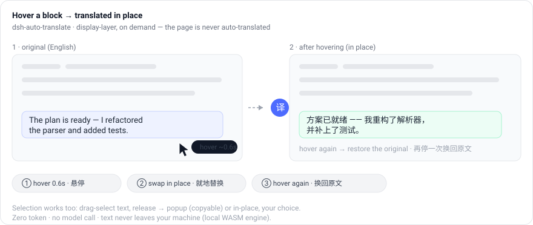
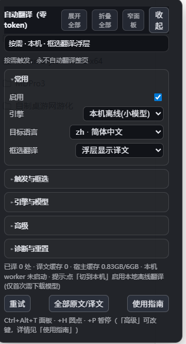

<div align="center">

# dsh-auto-translate

**Hover a block → it becomes Chinese in place. No auto-translation, no tokens, nothing leaves your machine.**

[](https://www.npmjs.com/package/dsh-auto-translate)
[](https://www.npmjs.com/package/dsh-auto-translate)
[](LICENSE)

[](https://github.com/deepseek-ai/deepseek-harness)





中文说明：[README.md](README.md)

</div>

## What it does, in 30 seconds

- **Hover** any block of the DSH reply for ~0.6s → that block is swapped to Chinese **in place**; hover again → back to the original. Flip back and forth as often as you like.
- Or **drag-select** text and release: a floating panel with original + translation (copyable) by default, or switch the panel to **in-place** mode.
- **Nothing is auto-translated** (deliberate since 0.4.0). Until you act, the plugin does not touch the page — it never rewrites an interface you are reading or typing into.
- **Zero tokens**: no DSH model call, no API bill. Translation runs **inside your browser** (ONNX Runtime WebAssembly via transformers.js); the model downloads once and then works offline.

## How it differs from "translate the whole page" plugins

| | This plugin | Typical auto-translators |
| --- | --- | --- |
| Trigger | **hover / selection, on demand** | translate on page load |
| Cost | **zero tokens** (on-device WASM or a keyless engine; no model call) | usually an LLM / cloud API, billed per use |
| Privacy | **text stays on your machine** by default (only model weights are fetched) | text is sent to a third-party service |
| Side effects | skips inputs, code blocks, editors and its own panel | often translates what you are typing |

> Want the **whole page and the reasoning chain auto-translated into 8 languages** instead?
> [dsh-think-translate](https://github.com/UncleK/dsh-think-translate) is the right tool — that is the
> opposite trade-off (coverage in exchange for automatic triggering and cloud engines).
> This plugin chooses **on demand + zero cost + nothing leaves the machine**.

## Install

```bash
# one command (npm)
dsh plugin --profile web add dsh-auto-translate
# then restart `dsh web` and refresh the browser page
```

A translucent chip labelled 译 appears at the bottom-left. Lost the chip? Press `Ctrl+Alt+T`.

<details>
<summary>Four other ways to install (GitHub / local dir / tarball / Gitee mirror)</summary>

```bash
# GitHub
dsh plugin --profile web add github:gst20060726/dsh-auto-translate

# local directory (development / offline)
dsh plugin --profile web add link:/absolute/path/to/dsh-auto-translate

# local tarball: npm pack, then hand the file over
dsh plugin --profile web add /path/to/dsh-auto-translate-0.4.2.tgz

# Gitee mirror (no GitHub needed)
dsh plugin --profile web add 'git+https://gitee.com/nysjn/dsh-auto-translate.git#<commit>'
```

`scripts/publish.ps1 -Target tgz|zip|bundle|gitee|github|npm` automates all of them
(tgz/zip/bundle are fully local; gitee/github/npm ask for credentials interactively and never store them).

> The package ships **without** the ~74MB ONNX Runtime wasm (the host fetches and caches it from a CDN on first use).
> Run `npm run fetch-vendor` before packing for a **fully offline** install.

</details>

## Usage

| Action | Effect |
| --- | --- |
| hover ~0.6s | that block is swapped in place; move away and hover again to flip back to the original |
| drag-select and release | translate the selection: floating panel by default (copy button), or switch the panel to **in-place** (click the page / press `Esc` to restore). **Large selections are split into sentence chunks** and translated chunk by chunk with an `i/n chunks` progress line |
| `Alt` + hover | translate/flip immediately (skip the 0.6s delay) |
| `Ctrl+Alt+T` | open/close the panel (use this if you lost the chip) |
| `Ctrl+Alt+H` | show/hide the chip |
| `Ctrl+Alt+P` | pause/resume translation (pausing restores the originals) |

The panel is grouped into *Common / Trigger & selection / Engine & models / Advanced / Diagnostics* (collapsed by default, expand-all at the top, plus a narrow mode). It also holds: target language, hover delay, **who translates** (local / online keyless / custom endpoint), selection mode, minimum selection length, selection cap (`0` = no limit), endpoint, Latin source language, download & warm-up, switch-to-local, retry, restore all, clear cache, the guide, and save/copy diagnostics. All hotkeys are rebindable.

### Coverage (what it can and cannot translate)

| | Scope |
| --- | --- |
| **Can** | The DSH UI itself (shell, sidebar, buttons, dialogs, messages, tool output), anything other plugins render, and **text inside Web Components (shadow roots)** |
| **Skips** | Inputs, `code`/`pre` (unless "also translate code" is on), `contenteditable`, CodeMirror/Monaco, and this plugin's own panel |
| **Cannot** | Anything **outside the DSH page**: other browser tabs, other websites, native apps. The plugin is injected into the DSH web UI only — use a browser extension/userscript for those |

A single selection translates up to **4000 characters** by default (configurable in the panel, `0` = no limit; a 60000-char hard cap remains). Beyond the cap you get an explicit "capped at the first N chars" note.

## Engines

> Since 0.4.0 the engine only decides **who translates** — never *when*. Triggering is always on demand.

| Engine | Tokens | Network | Notes |
| --- | --- | --- | --- |
| **Local WASM (recommended, default)** | none | first model download only | ~425MB for en↔zh; disk and memory cost |
| Online keyless | none | every string goes to MyMemory | anonymous daily quota, may return 429 |
| Custom endpoint | none | your own service | e.g. self-hosted LibreTranslate |

## Local models

| Pair | Model | Size | Note |
| --- | --- | --- | --- |
| en → zh | `Xenova/opus-mt-en-zh` | 200MB encoder + 225MB decoder | **fp32** on purpose: the quantized export triggers `TransposeDQWeightsForMatMulNBits Missing required scale` on ONNX Runtime here |
| zh → en | `Xenova/opus-mt-zh-en` | same | fp32 as well |
| ja/ko/others → zh | `Xenova/nllb-200-distilled-600M` | ~600MB | 200 languages, downloaded on demand |

- Models are fetched through the plugin's own **same-origin proxy** (`/dsh-auto-translate/model-v2/...`): the host side does **resumable downloads with 12 retries** and caches to disk, avoiding CORS and broken transfers.
- Browser cache lives in Cache Storage; the host cache lives in `$DSH_HOME/dsh-auto-translate/models`.
- Start with en↔zh only to save bandwidth; other pairs download on first use.
- **Repo size**: the ~74MB ONNX Runtime wasm is not committed. On first use the host fetches it into `$DSH_HOME/dsh-auto-translate/ort-cache`; for a **fully offline** install run `npm run fetch-vendor` to materialise `vendor/ort/`.

## Troubleshooting

| Symptom | Fix |
| --- | --- |
| Chip missing | `Ctrl+Alt+T` opens the panel (it also reveals the chip and fixes an off-screen position) |
| Nothing gets translated | Check the panel's counters (scanned / queued / translated / skipped / failed). If *translated* stays 0, read the error box |
| Local model fails to load | Click **Save diagnostics to file** and inspect `$DSH_HOME/dsh-auto-translate/diagnose-*.json` |
| Download stuck | Click **Retry** — the host cache resumes; the second attempt usually succeeds |
| Full reset | Panel **clear cache** plus clearing site data (the model lives in Cache Storage) |

## Architecture

```
dsh-auto-translate/
|- index.js              # host: static vendor route, same-origin model proxy (disk cache), diagnostics sink
|- client.js             # browser: scan / translate / hover toggle / settings panel
|- vendor/
|   |- worker.v5.js      # Web Worker: SharedWorker single-owner WASM inference, lazy per-pair pipelines
|   |- transformers.esm.v2.js  # transformers.js browser ESM with local ORT imports
|   |- ort/              # ONNX Runtime loaders (+ wasm fetched from CDN if absent)
|- scripts/fetch-vendor.mjs     # regenerate vendor/ for a fully offline install
|- scripts/verify-browser.mjs   # real-browser acceptance (optional, see below)
|- demo/                 # README assets: hover-flow.svg (hand-drawn concept), panel.png (real screenshot, cropped)
|- package.json / cordis.patch.yml
```

- The host half does exactly three things: `/dsh-auto-translate/vendor/*` (static), `/model-v2/*` (model proxy + disk cache), `/diag` (dump diagnostics).
- The browser half registers no tool and calls no model; inference happens in a Worker, the main thread only swaps text.

### Verifying changes

```bash
npm test                  # 47 checks: contract + i18n + jsdom E2E (no browser needed)
npm run verify:browser    # real browser: panel layout / scrolling / clipping + real mouse hover and selection
```

`verify:browser` launches your local Edge/Chrome with a **throwaway profile** (it never touches your real browser data) and needs `puppeteer-core` (often already present in the DSH config dir; otherwise `npm i --no-save puppeteer-core`). It exists because jsdom has no layout engine: it cannot catch "the panel does not fit and has to scroll" or clipped text. It prints a JSON report plus screenshots and exits non-zero on any failure.

> `demo/panel.png` in this README is that script's output, cropped by 16px on each side so only the plugin's own
> panel remains (no conversation content). **Full-page screenshots stay local in `demo/raw/` (gitignored)** — they
> contain the real session.

## Compatibility

- DeepSeek Harness `0.1.5-rc.1` or newer (profile `web`).
- Chrome / Edge 116+ (module worker + WASM); the on-device engine needs Chrome/Edge 138+.

## License

MIT
